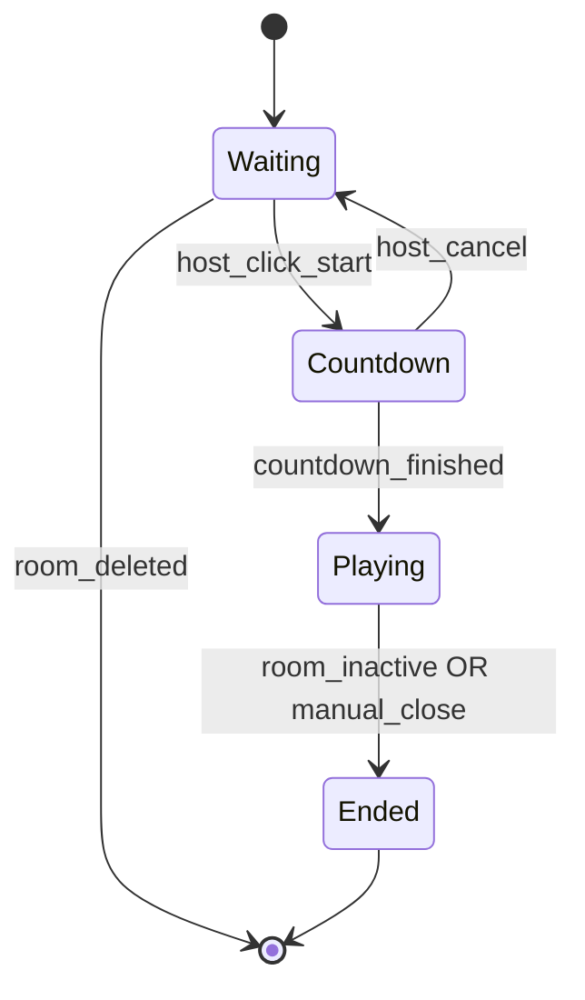
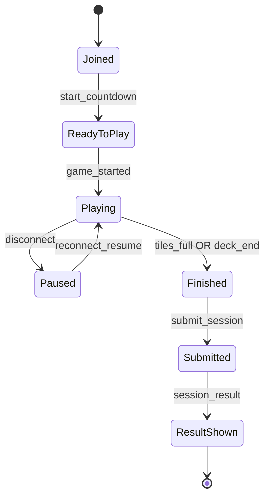

# ⚽ Real-Time Football Grid Game

This repository contains the architecture and lifecycle for a real-time multiplayer football grid game.

Players join a room using only a **name** and a **room code**, then compete independently by matching players to a 16-tile board. After finishing, results are validated server-side, and a **live leaderboard** updates for all participants.

This document outlines:

- Room creation
- Countdown
- Independent gameplay per user
- WebSocket events
- Redis runtime state
- Server-side scoring
- Real-time leaderboards
- State machines & lifecycle

The system uses:

- **React** (frontend)
- **Node.js + Socket.IO** (backend)
- **Redis** (runtime state + resume)
- **Postgres or MongoDB** (persistent data)

No authentication is required — only **name** + **room code**.

---

## 🏗 Architecture

```
React Client 
   ⬄ WebSockets (Socket.IO)
Node.js Game Server
   ⬄ Redis (runtime state)
   ⬄ Postgres / MongoDB (persistent scoring, truth map)
```

### Key points
- Each player progresses **independently** (local 10-second timers)
- Same 16 tiles + same 60-player deck for every player
- All scoring happens **server-side**
- Leaderboard updates broadcast over WebSockets

---

## 🧩 Game Flow

### 1. Create Room
Host creates a room → server generates:
- roomCode  
- 16-category board  
- 60-player deck (45 valid, 15 filler)  
- deckVersion  
Stored in Redis with status `waiting`.

### 2. Join Room
Players join using:
- name  
- room code  

Server:
- Ensures name uniqueness inside room  
- Stores per-user state in Redis  
- Returns: tiles, deck, resumeState (if reconnecting)

### 3. Host Starts Game
Minimum players: **2**  
Server sets status `countdown`, broadcasts:

```
start_countdown { seconds: 10 }
```

### 4. Game Starts
Server sets status `playing` and broadcasts:

```
game_started { timestamp, deckVersion }
```

Clients start independent game sessions.

### 5. Gameplay (Independent)
Each player:
- Starts at deck index 0  
- Shows each player for 10 seconds (local timer)  
- Can assign a tile once  
- Sends `assign_tile` events  
- Server stores runtime state in Redis

### 6. End of Game (per user)
Triggered when:
- 16 tiles filled  
- OR deck exhausted  
- OR user clicks finish

Client sends:
```
submit_session
```

### 7. Scoring
Server:
- Validates using truth map  
- Computes:
  - score = correctTiles × 3  
  - tie-breakers: time, clicks  
- Persists results  
- Broadcasts `leaderboard_update`  

---

## 🧠 Deck Generation

- 16 categories (tiles)
- Deck: 60 players
  - 45 players must match **≥ 1 category**
  - Each matching player matches **1–4 categories**
  - 15 players match **0 categories** (noise)
- Deck is shuffled and versioned

---

## 🔁 State Machines

### Room



### Per-User



---

## 📡 WebSocket Events

### Client → Server
- `create_room`
- `join_room`
- `host_click_start`
- `assign_tile`
- `submit_session`
- `reconnect_resume`

### Server → Client
- `room_created`
- `room_joined`
- `start_countdown`
- `game_started`
- `assign_ack`
- `session_result`
- `leaderboard_update`

---

## 🗄 Redis Keys

```
room:<code>
room:<code>:players
room:<code>:player:<name>
room:<code>:leaderboard
```

TTL:
- Room: 24h  
- Player state: 30–60 minutes  

---

## 🎯 Scoring

```
score = correctTiles * 3
```

Tie-breakers:
1. totalTimeSeconds  
2. clickCount  

---

## 🔒 Anti-Cheat

- Deck versioning  
- Validate submitted players vs deck  
- Validate tile usage once  
- No truth map sent to clients  
- Idempotent WebSocket events  

---

This system provides the foundation for a scalable, reliable, real-time multiplayer experience.