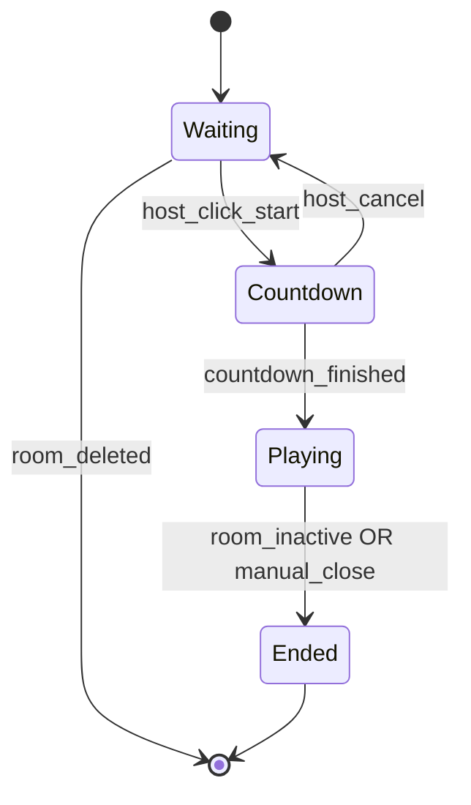
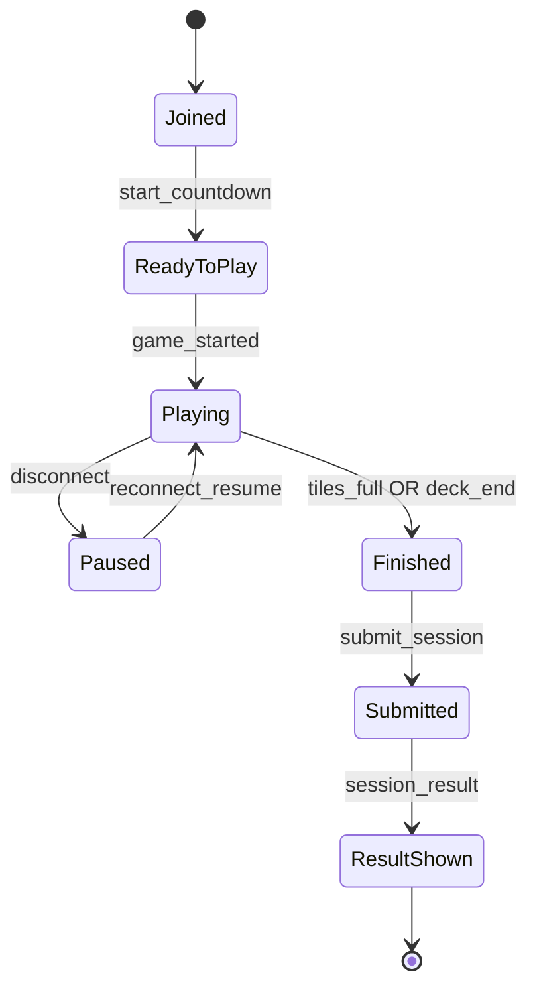
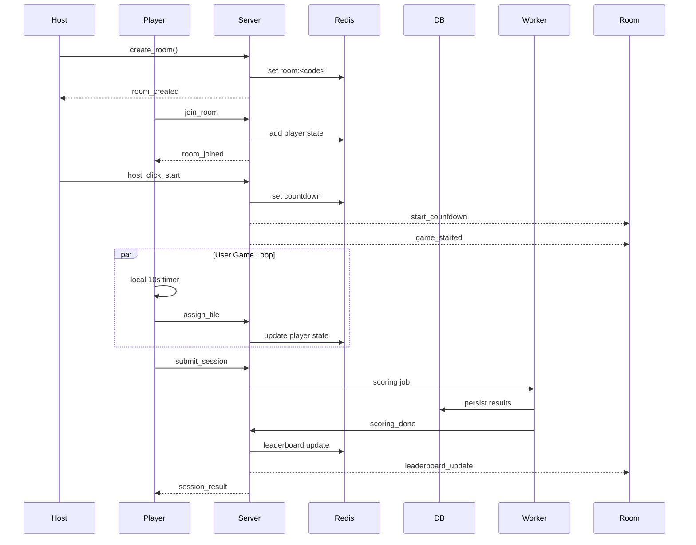

# 📐 Architecture Document

## Overview
This document describes the complete architecture for a real-time multiplayer football grid game using:

- **React**  
- **Node.js + Socket.IO**  
- **Redis**  
- **Postgres or MongoDB**

### Design Goals
- Large rooms (1,000+ players)
- Independent user progression
- Fast WebSocket updates
- Anti-cheat integrity
- Simple user flow (name + room code)
- Resumable sessions

---

# 🧱 System Components

## Frontend (React)
- Join/create room  
- Countdown UI  
- Local 10s timers  
- Independent deck traversal  
- Tile assignment + locking  
- Submit final result  
- Listen to leaderboard updates  
- Reconnect/resume state  

## Backend (Node.js / Socket.IO)
- Manage rooms  
- Orchestrate countdown  
- Broadcast start  
- Handle assignment events  
- Persist runtime state to Redis  
- Final scoring  
- Leaderboard broadcasting  

## Redis (Ephemeral State)
Stores:
- Room metadata  
- Player runtime state  
- Leaderboard cache  
- Resume state  
- Inactivity detection  

## Database (Postgres/Mongo)
Persists:
- Truth map  
- Sessions  
- Assignments  
- Results history  
- Analytics  

## Worker Queue (BullMQ)
Used for:
- Scoring  
- Writing results  
- Publishing leaderboard updates  

---

# 🧠 Game Seed

## 16-Category Board
Generated at room creation.

## 60-Player Deck
Rules:
- 45 players match ≥1 category  
- Each matching player matches 1–4 categories  
- 15 players match 0 categories  
- Deck is shuffled  
- Assigned a `deckVersion`  

---

# 🏗 Room Lifecycle

## 1. Room Creation
Server:
- Generates roomCode  
- Builds gameSeed (tiles + deck + version)  
- Sets status `waiting`  
- Stores in Redis  

## 2. Join Room
Players send:
```
name + roomCode
```

Server:
- Ensures unique name  
- Creates runtime state  
- Sends gameSeed + resumeState  

## 3. Start Countdown
Host triggers:
```
host_click_start
```

Server:
- Sets status `countdown`  
- Broadcasts `start_countdown { seconds: 10 }`

## 4. Game Start
After countdown:
- Server sets status `playing`
- Broadcasts:
```
game_started { timestamp, deckVersion }
```

Clients begin playing independently.

## 5. Gameplay (User-Independent)
- Client controls 10s-local timers  
- Local progression through deck  
- Sends WebSocket `assign_tile` events  
- Server logs assignments → Redis  

## 6. Finish Conditions
User finishes when:
- All 16 tiles filled  
- OR deck end  
- OR user clicks finish  

Client sends:
```
submit_session
```

## 7. Scoring
Worker:
- Validates tile assignments  
- Computes score  
- Writes session to DB  
- Updates Redis leaderboard  
- Triggers broadcast  

## 8. Cleanup
Room removed after:
- All players leave  
- OR inactivity timeout  

---

# 🔌 WebSocket Events

## Client → Server
- `create_room`
- `join_room`
- `host_click_start`
- `assign_tile`
- `submit_session`
- `reconnect_resume`

## Server → Client
- `room_created`
- `room_joined`
- `start_countdown`
- `game_started`
- `assign_ack`
- `session_result`
- `leaderboard_update`

---

# 🗄 Redis Schema

```
room:<code>
  status
  gameSeed (tiles, deck, deckVersion)
  countdown_expires_at
  startedAt

room:<code>:players     // set
room:<code>:player:<name>   // hash
room:<code>:leaderboard     // sorted set or JSON

TTL:
- room: 24h
- player: 30–60 min idle
```

Player State:
```
currentIndex: int
occupiedTiles: JSON
clicks: int
startedAt: timestamp
lastSeenAt: timestamp
finishedAt: timestamp|null
```

---

# 📊 Database Schema (Simplified)

### players
```
id, name, meta, avatar_url
```

### tiles
```
id, label
```

### player_correct_tile
```
player_id, tile_id
```

### sessions
```
id, room_code, name, total_time, clicks, score
```

### session_assignments
```
session_id, tile_id, player_id
```

### session_results
```
session_id, correct_count
```

---

# 🔁 State Machines

## Room


## User


---

# 📡 Sequence Diagram



---

# 🔒 Anti-Cheat Protection

- Deck version enforcement  
- Validate player IDs belong to deck  
- Validate tile IDs 1–16  
- Ensure tile is assigned once per player  
- Ensure playerIndex progression is valid  
- Rate-limit WebSocket events  
- Final scoring happens server-side only  

---

# ⚙ Scaling & Deployment

- Use Socket.IO Redis adapter for horizontal scaling  
- Multiple Node.js instances  
- Managed Redis (Elasticache/Redis Cloud)  
- Managed Postgres (RDS) or MongoDB Atlas  
- Docker containers for all services  
- Optional Kubernetes deployment  

---

# 🎯 Summary

This architecture supports:
- Real-time WebSocket gameplay  
- Large rooms  
- Independent progression per user  
- Fault-tolerant resume  
- Secure server-side scoring  
- Live leaderboards  

It is robust, scalable, and ready for implementation.

